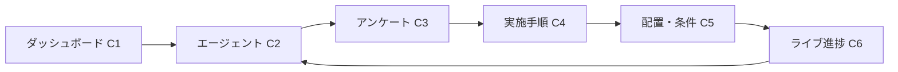
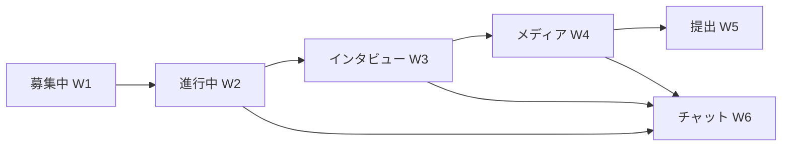

````markdown
# AI街頭調査 UI（Client / Worker）README

このリポジトリは、**クライアント**（依頼者）と**ワーカー**（現地実施者）がAIエージェントを介して街頭調査を設計・実行・モニタリングするための、**静的UIモック**です。  
ビルド不要・**HTML+C S Sのみ**で動くため、そのままローカルで確認できます。

---

## 1) クイックスタート

- そのまま `client/*.html` / `worker/*.html` をブラウザで開くだけ
- 開発用に VS Code の **Live Server** を使うのが便利です

```bash
# 例（任意）
project-root/
  assets/styles.css
  client/client_dashboard.html
  worker/worker_home.html
````

> **ダーク/ライト自動対応**：OS設定の `prefers-color-scheme` を検出して自動切替

---

## 2) ディレクトリ構成

```
project-root/
├─ assets/
│  └─ styles.css          … 共通スタイル（ライト/ダーク両対応、A11y考慮）
├─ client/                 … クライアント（依頼者）用UI
│  ├─ client_dashboard.html      （C1）
│  ├─ client_chat.html           （C2）
│  ├─ survey_builder.html        （C3）
│  ├─ procedure_builder.html     （C4）
│  ├─ targeting.html             （C5）
│  └─ live_progress.html         （C6）
└─ worker/                 … ワーカー（実施者）用UI
   ├─ worker_home.html           （W1）
   ├─ worker_task_detail.html    （W2）
   ├─ worker_interview.html      （W3）
   ├─ worker_media.html          （W4）
   ├─ worker_submit.html         （W5）
   └─ worker_chat.html           （W6）
```

> クライアント側とワーカー側の**相互リンクはありません**（運用ポリシーに合わせて分離）。

---

## 3) 画面一覧と役割

### クライアント側（Client）

| ID | ファイル名                    | 役割                | 主な操作                |
| -- | ------------------------ | ----------------- | ------------------- |
| C1 | `client_dashboard.html`  | 案件一覧 / KPI        | 検索・絞り込み、案件へ遷移       |
| C2 | `client_chat.html`       | エージェントと要件ヒアリング    | 要件入力、提案受領、設計へ進む     |
| C3 | `survey_builder.html`    | アンケート設計           | 質問編集、所要時間/バリデーション確認 |
| C4 | `procedure_builder.html` | 実施手順（台本/同意/撮影ガイド） | 台本編集・翻訳確認、ワーカープレビュー |
| C5 | `targeting.html`         | 配置・条件（地図/対象者/報酬）  | エリア指定、回収設定、募集開始     |
| C6 | `live_progress.html`     | ライブ進捗（ヒート・ストリーム）  | 介入提案の適用、サンプル確認      |

### ワーカー側（Worker）

| ID | ファイル名                     | 役割                      | 主な操作          |
| -- | ------------------------- | ----------------------- | ------------- |
| W1 | `worker_home.html`        | タスク一覧                   | 受注/申請、詳細へ遷移   |
| W2 | `worker_task_detail.html` | タスク詳細（地図・手順概要）          | インタビュー開始、チャット |
| W3 | `worker_interview.html`   | インタビュー（台本/ガイド/NG、REC導線） | 同意確認、回答入力、録音  |
| W4 | `worker_media.html`       | 写真・音声の取得                | 撮影ガイド、録音プレビュー |
| W5 | `worker_submit.html`      | 提出前セルフQC                | チェック完了→提出     |
| W6 | `worker_chat.html`        | エージェントと連絡               | 指示確認、質問       |

---

## 4) 画面遷移

### クライアント（同系内で相互遷移、サブナビ常設）



### ワーカー（同系内のみ、サブナビ常設）



> いずれも**上部サブナビ**から同系内ページへ直接移動できます。
> **クライアント⇄ワーカーの遷移リンクはありません。**

---

## 5) デザイン指針（A11y & ブランディング）

* **配色**：明度差を確保。ライト/ダーク両対応。

  * ブランド：`--primary #2B6CF6` を軸に、**REC系アクセント**（standby/live/paused/saved）を導入
  * 重大度（OK/WARN/ERR/INFO）トークンで**フラグの可読性**を担保（`--sev-*`）
* **タイポグラフィ**：`Inter` + `Noto Sans JP`（本文16px / 1.72行）
* **コンポーネント**：カード/チップ/タブ/ピルは**統一のトークン**で構築
* **フォーカス表示**：`box-shadow` による**外枠リング**（角丸に追従）
* **テキストエリア**：長文は**角丸の矩形**（pill形にしない）で**行間1.8**
* **コントラスト**：主要ボーダーを **1.25px** に強化、情報の“決定要素”が見やすい

---

## 6) ページ間の主な連携

* **要件→設計→配布→モニタ**（C2 → C3 → C4 → C5 → C6）
  エージェントの提案（C2/C6）を採用すると、**設計や配置に反映**する導線あり
* **ライブ介入**（C6）：報酬加算・エリア拡張・台本順序の調整を**即時反映**（UIモック）
* **ワーカー実行**（W2 → W3）：**台本/ガイド/NG例**を切替、REC状態を視覚表示（standby/live/paused/saved）
* **コミュニケーション**：C2（クライアント↔エージェント） / W6（ワーカー↔エージェント）

---

## 7) スタイルカスタマイズ

* すべて `assets/styles.css` の **CSS変数**で調整できます

  * 例：ブランド色変更 → `--primary`
  * フラグ色調整 → `--sev-ok-*`, `--sev-warn-*`, `--sev-err-*`, `--sev-info-*`
* **暗い場所での可読性**：ダーク系では `--text / --surface / --surface-sub` を優先して調整

---

## 8) 既知の仕様・メモ

* 本UIは**データ接続なし**のモックです
  実装時はボタン・リンクのイベントにAPI呼び出しや状態管理を付与してください
* マップはダミー（CSS描画）。実装時はポリゴン/半径指定に差し替え
* 入力欄は**キーボード操作優先**で設計（タブ移動とフォーカスが明確）

---

## 9) スクリーンショット（任意）

* `docs/` 配下に `client_*.png` / `worker_*.png` を置くとREADMEから参照可能にできます
  例：`docs/client_chat.png`, `docs/worker_interview.png`

---

## 10) ライセンス / 貢献

* ライセンスはプロジェクト方針に合わせて設定してください（例：MIT）
* 改善PR歓迎です。UI変更時は `styles.css` の**トークン整合**にご注意ください

---

### 付録：ページ直リンク（ローカル）

* クライアント：
  `client/client_dashboard.html` → `client/client_chat.html` → `client/survey_builder.html` → `client/procedure_builder.html` → `client/targeting.html` → `client/live_progress.html`
* ワーカー：
  `worker/worker_home.html` → `worker/worker_task_detail.html` → `worker/worker_interview.html` → `worker/worker_media.html` → `worker/worker_submit.html`（チャットは常時 `worker/worker_chat.html`）

---

不明点や追加したい導線があれば、どの画面に何を足したいかだけ教えてください。すぐモックに反映します。

```
```
